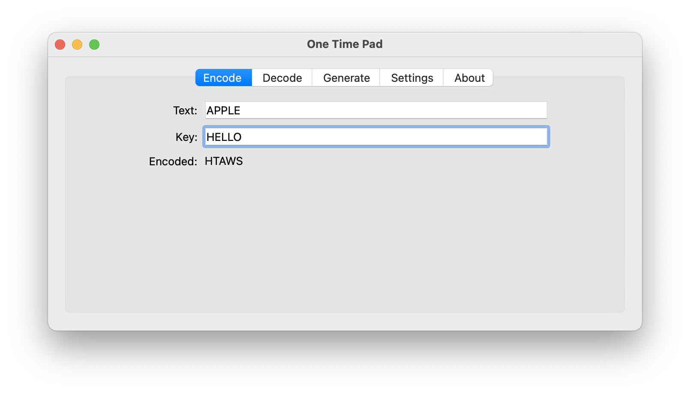
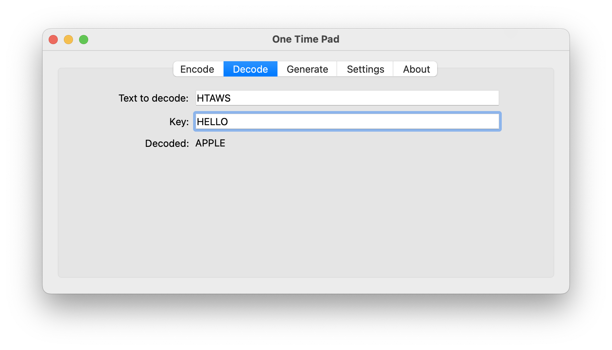
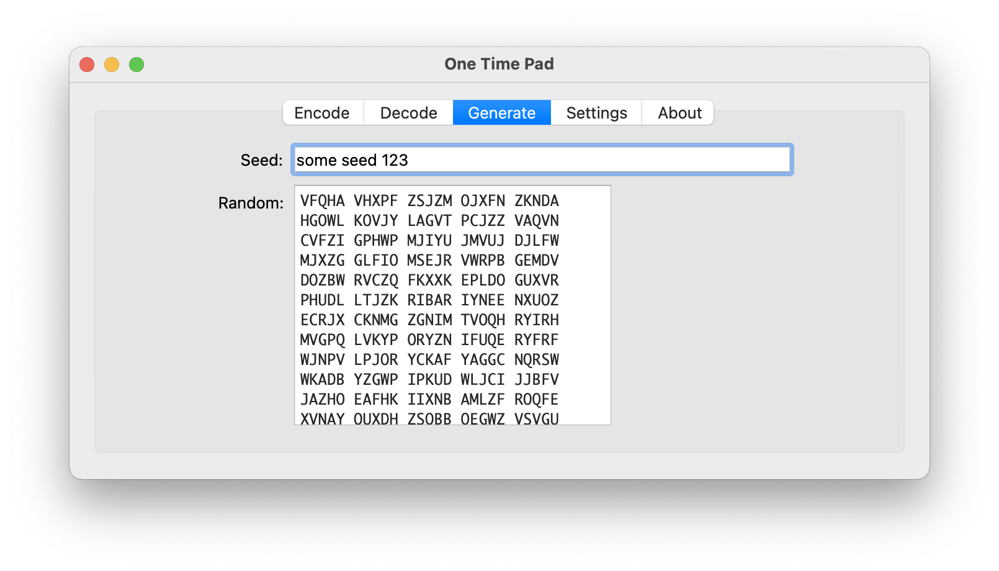
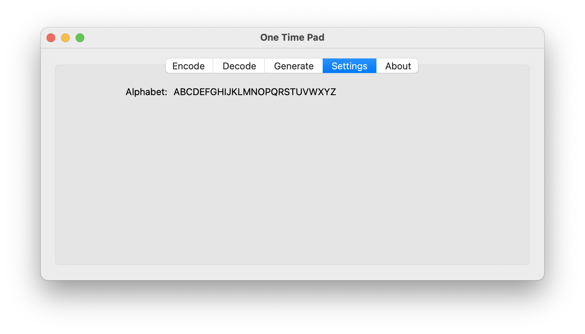

# About
Graphical user interface for the kinneyotp (one time pad) module.

# Screens






# To install

Run the following commands to setup a python virtual environment, then install the module.

```
python3 -m venv venv
venv/bin/activate
pip install kinneyotpgui
```

After the installation, you should be able to run:

```
otp
```

# For a local installation (for development):
```
pip install -r requirements.txt
pip install -e .

```
